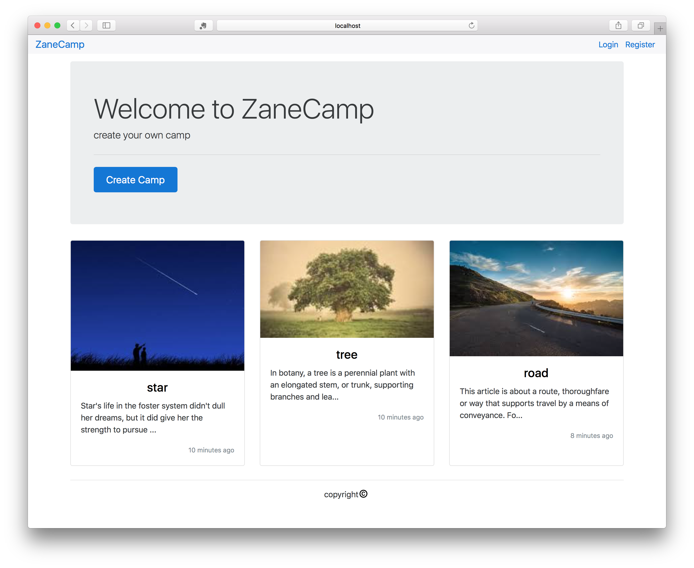

# ZaneCamp

A camp website developed using Node.js Express and MongoDB. It contains user system,  article post and comments.

I use the following techniques:

- Node.js
- Express.js
- Bootstrap4
- MongoDB
